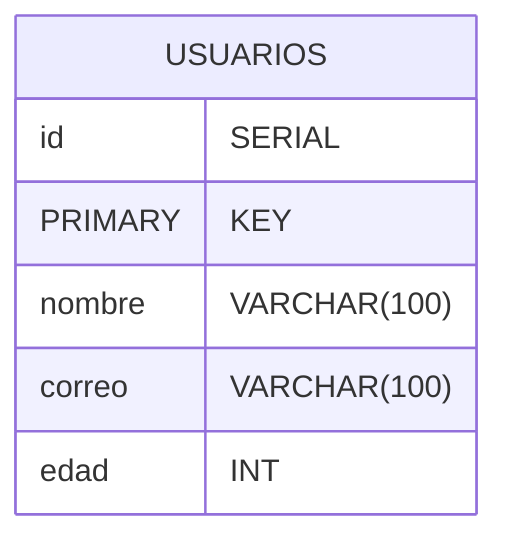

# Documentacion

## Descripción 

Este proyecto es un ejemplo de cómo crear un microservicio utilizando Node.js y Express que se conecta a una base de datos PostgreSQL, y un frontend en Angular que consume los datos del microservicio. 

## Requisitos 
- Node.js (versión reciente) 
- PostgreSQL (versión reciente) 
- Angular CLI

## estructura del proyecto

```shell
├── Back
│   ├── api_test.http
│   ├── package.json
│   ├── package-lock.json
│   ├── server.js
│   └── __tests__
│       └── server.test.js
├── README.md
└── front
    ├── angular.json
    ├── package.json
    ├── package-lock.json
    ├── public
    │   └── favicon.ico
    ├── README.md
    ├── src
    │   ├── app
    │   │   ├── api.service.ts
    │   │   ├── app.component.css
    │   │   ├── app.component.html
    │   │   ├── app.component.spec.ts
    │   │   ├── app.component.ts
    │   │   ├── app.config.ts
    │   │   ├── app.routes.ts
    │   │   └── user-list
    │   ├── index.html
    │   ├── main.ts
    │   └── styles.css
    ├── tsconfig.app.json
    ├── tsconfig.json
    └── tsconfig.spec.json


```

## Modelo Entidad Relacion (ER)


## Parte 1: Backend (Microservicio con Node.js + Express) 
### Pasos para Ejecutar el Backend Localmente 
1. Clonar el repositorio: 
    ```bash 
    git clone https://github.com/d-ariza/ler_test
    cd ler_test
   ``` 
2. Instalar las dependencias: 
   ```bash 
    npm install 
    ``` 
3. Configurar la base de datos PostgreSQL y crear la tabla (ver seccion creacion de la base de datos) 
4. Ejecutar el servidor: 
   ```bash 
   node server.js 
   ``` 
   El servidor se ejecutará en `http://localhost:3000`.

## creacion de la base de datos
```postgresql
-- Crear el usuario
CREATE USER ler WITH PASSWORD '1234';

-- Crear la base de datos
CREATE DATABASE ler_db OWNER ler;

-- Conectarse a la base de datos
\c ler_db

-- Crear la tabla usuarios
CREATE TABLE usuarios (
  id SERIAL PRIMARY KEY,
  nombre VARCHAR(100),
  correo VARCHAR(100),
  edad INT
);

-- Insertar datos de ejemplo
INSERT INTO usuarios (nombre, correo, edad) VALUES
('Juan Pérez', 'juan.perez@example.com', 28),
('María García', 'maria.garcia@example.com', 34),
('Carlos López', 'carlos.lopez@example.com', 25),
('Ana Martínez', 'ana.martinez@example.com', 30);


```

## Parte 2: Frontend (Angular)

### Pasos para Ejecutar el Frontend Localmente

1.  Instalar las dependencias:
    ```bash
    npm install
    ```

3. Ejecutar la aplicación Angular:
    ```bash
    ng serve
    ```

La aplicación se ejecutará en `http://localhost:4200`.


## Evaluacion requisitos

1. Backend: Node.js+ Express
    - Estado: Cumplido
    - Configure el servidor para conectarse a una base de datos PostgreSQL y proporcionar una API para obtener los datos de los usuarios.

1. Base de datos: PostgreSQL
   - Estado: Cumplido
   - Utilice PostgreSQL como la base de datos.
   - Configuramos una conexión a la base de datos y realizamos consultas para obtener los datos de los usuarios.

1. Frontend: Angular (consumirá los datos del microservicio)
   - Estado: Cumplido
   - Implemente un frontend en Angular que consume los datos proporcionados por el backend.
   - Mostre los datos en una tabla estilizada con Bootstrap.

2. Versiones recientes de Node.jsy PostgreSQL
    - Estado: Cumplido
    - Confirmo estar usando versiones recientes de Node.jsy PostgreSQL.
    - Node.js: v20.11.0 (o superior)
    - PostgreSQL: 16.6

1. Uso de cualquier herramienta de tu preferencia para pruebas y despliegue (Postman, Docker, etc.)
   - Estado: Cumplido
   - pruebas: se usó Jest para la prueba que está en backend/__test__. al ejecutar devolvio el siguiente resultado
    ```shell
      npm test                                                                                                                                                                                                                      ─╯

      > prueba_ler@1.0.0 test
      > jest

    PASS  __tests__/server.test.js (7.762 s)
    GET /api/data
    ✓ debería devolver una lista de usuarios (141 ms)
    
    Test Suites: 1 passed, 1 total
    Tests:       1 passed, 1 total
    Snapshots:   0 total
    Time:        8.314 s
    Ran all test suites.
    Jest did not exit one second after the test run has completed.
    
    'This usually means that there are asynchronous operations that weren't stopped in your tests. Consider running Jest with `--detectOpenHandles` to troubleshoot this issue.

    ```
  - Postman: se incluye el archivo api_test.http. Si hubiera más partes del CRUD las pruebas ya están listas para ser desplegadas. el resultado del GET fue:
   
  ```http request 
            GET http://localhost:3000/api/data
        
            HTTP/1.1 200 OK
            X-Powered-By: Express
            Access-Control-Allow-Origin: *
            Content-Type: application/json; charset=utf-8
            Content-Length: 318
            ETag: W/"13e-FvhfuKk/Vd2ju5EzlzA7AjTXQeo"
            Date: Wed, 15 Jan 2025 05:17:06 GMT
            Connection: keep-alive
            Keep-Alive: timeout=5
            
            [
              {
                "id": 1,
                "nombre": "Juan Pérez",
                "correo": "juan.perez@example.com",
                "edad": 28
              },
              {
                "id": 2,
                "nombre": "María García",
                "correo": "maria.garcia@example.com",
                "edad": 34
              },
              {
                "id": 3,
                "nombre": "Carlos López",
                "correo": "carlos.lopez@example.com",
                "edad": 25
              },
              {
                "id": 4,
                "nombre": "Ana Martínez",
                "correo": "ana.martinez@example.com",
                "edad": 30
              }
            ]
            Response file saved.
            > 2025-01-15T001706.200.json
            
            Response code: 200 (OK); Time: 26ms (26 ms); Content length: 313 bytes (313 B)
  ```
  - Docker: Si desea, puedes usar Docker para contenerizar la aplicación y facilitar el despliegue.
    - Crear un archivo Dockerfile para el backend:
    ```dockerfile
    FROM node:20-alpine
    
    WORKDIR /app
    
    COPY package*.json ./
    RUN npm install
    
    COPY . .
    
    EXPOSE 3000
    CMD ["node", "server.js"]
    ```
    ahora se crea el docker-compose.yaml para el backend y la base de datos
    ```yaml
    version: '3.8'
    services:
      db:
          image: postgres:latest
          environment:
            POSTGRES_USER: ler
            POSTGRES_PASSWORD: 1234
            POSTGRES_DB: ler_db
          ports:
            - "5432:5432"
      backend:
        build: .
        environment:
          DATABASE_URL: postgres://ler:1234@db:5432/ler_db
        ports:
          - "3000:3000"
        depends_on:
        - db
    ``` 
    ejecutar el compose
    ```shell 
    docker-compose up --build
    ```

## Revision de instrucciones del proyecto

### Parte 1: Backend (Microservicio con Node.js + Express)

1. **Crear un microservicio que se conecte a una base de datos PostgreSQL**
    - **Configurar el servidor utilizando Express**:
      ✔ Se ha configurado el servidor utilizando Express.

    - **Utilizar la librería `pg` para la conexión a la base de datos**:
      ✔ Se ha utilizado la librería `pg` para conectar con la base de datos PostgreSQL.

    - **Implementar una ruta GET para obtener los datos de una tabla llamada `usuarios`**:
      ✔ Se ha implementado una ruta GET en `/api/data` que obtiene los datos de la tabla `usuarios`.

    - **Estructura de la tabla `usuarios`**:
      ✔ La tabla `usuarios` se ha creado con la siguiente estructura:

      ```sql
      CREATE TABLE usuarios (
        id SERIAL PRIMARY KEY,
        nombre VARCHAR(100),
        correo VARCHAR(100),
        edad INT
      );
      ```

2. **El microservicio debe exponer una API en la ruta `http://localhost:3000/api/data` que devuelva los datos de la tabla en formato JSON**
   ✔ Se ha configurado la API para que devuelva los datos de la tabla `usuarios` en formato JSON en la ruta `http://localhost:3000/api/data`.

### Parte 2: Frontend (Angular)

1. **Crear un formulario en Angular que consuma el microservicio desarrollado en la Parte 1**
    - **Utilizar `HttpClient` para hacer la solicitud GET al backend y obtener los datos de los usuarios**:
      ✔ Se ha utilizado `HttpClient` en un servicio (`ApiService`) para realizar la solicitud GET al backend y obtener los datos de los usuarios.

    - **Mostrar los datos en un formulario simple**:
      ✔ Los datos se muestran en una tabla simple utilizando Bootstrap para el estilo.

    - **Cada usuario debe mostrarse en una fila con campos de texto que muestren su nombre, correo y edad**:
      ✔ Cada usuario se muestra en una fila de la tabla con sus respectivos campos de nombre, correo y edad.

2. **Diseño: El diseño no es una prioridad, pero el formulario debe ser funcional y permitir visualizar los datos correctamente**
   ✔ Se ha estilizado el formulario utilizando Bootstrap para hacerlo funcional y agradable a la vista.

### Verificación de Pruebas

También Se ha añadido una prueba básica para el backend utilizando Jest y Supertest para asegurar que la API funciona correctamente.

## Revision de citerios de evaluacion

### 1. Funcionamiento del Microservicio

- **El backend debe funcionar correctamente y conectarse a la base de datos PostgreSQL.**
   - ✔ Se ha implementado un servidor backend utilizando Node.js y Express que se conecta correctamente a una base de datos PostgreSQL.

- **La API debe devolver los datos de manera eficiente y en formato JSON.**
   - ✔ La API en la ruta `http://localhost:3000/api/data` devuelve los datos de la tabla `usuarios` en formato JSON de manera eficiente.

### 2. Integración del Frontend con el Backend

- **El formulario en Angular debe consumir y mostrar correctamente los datos del microservicio.**
   - ✔ Se ha desarrollado un formulario en Angular que utiliza `HttpClient` para realizar una solicitud GET al backend y obtener los datos de los usuarios, mostrando estos datos en una tabla estilizada y responsiva con Bootstrap.

### 3. Código Limpio y Buenas Prácticas

- **Se evaluará la calidad del código, la estructura del proyecto y el uso adecuado de herramientas y bibliotecas.**
   - ✔ Se ha seguido buenas prácticas de desarrollo, manteniendo un código limpio y bien estructurado.
   - ✔ Se usó herramientas y bibliotecas adecuadas como `pg` para la conexión a PostgreSQL, `HttpClient` para las solicitudes HTTP en Angular, y Bootstrap para el estilo.
   - ✔ Se ha añadido pruebas básicas utilizando Jest y Supertest para verificar el funcionamiento del backend.

### 4. Documentación Clara y Completa

- **El archivo README.md debe explicar claramente cómo ejecutar el proyecto y realizar las pruebas.**
   - ✔ Se ha creado un archivo `README.md` que incluye:
      - Pasos detallados para ejecutar el backend y el frontend localmente.
      - Comandos para crear la tabla `usuarios` en PostgreSQL.
      - Detalles sobre cómo probar el microservicio utilizando Postman o directamente desde el frontend.


